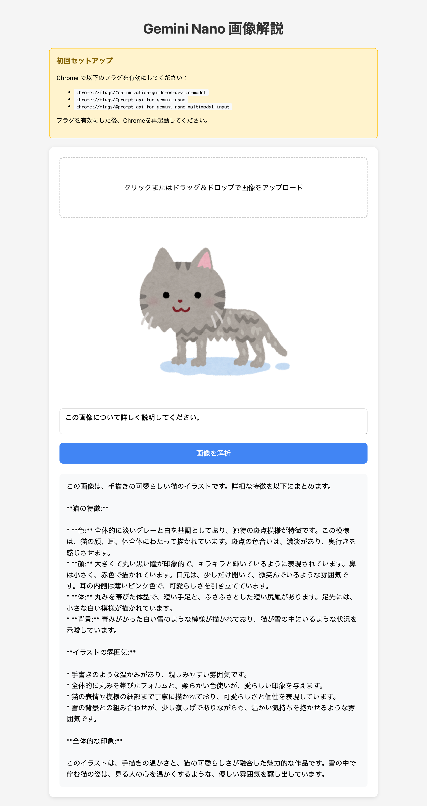

# Gemini Nano 画像解説アプリ

ブラウザ内で動作する Gemini Nano を使用して、画像の内容を解説する Web アプリケーションです。



## 特徴

- **完全ローカル処理**: 画像データは外部サーバーに送信されません
- **オフライン対応**: モデルダウンロード後はオフラインで動作
- **無制限利用**: API 制限なし

## 必要条件

- Chrome 131 以降
- モデルダウンロード用空きストレージ

## セットアップ

### 1. Chrome フラグの有効化

Chrome のアドレスバーに以下を入力し、それぞれ「Enabled」に設定してください：

```
chrome://flags/#optimization-guide-on-device-model
chrome://flags/#prompt-api-for-gemini-nano
chrome://flags/#prompt-api-for-gemini-nano-multimodal-input
```

### 2. Chrome を再起動

フラグを有効にした後、Chrome を完全に再起動してください。

### 3. アプリを開く

```bash
open index.html
```

または、ローカルサーバーを起動：

```bash
python3 -m http.server 8080
```

http://localhost:8080 でアクセス

## 使い方

1. 画像をドラッグ＆ドロップ、またはクリックしてアップロード
2. 質問を入力（デフォルト: 「この画像について詳しく説明してください。」）
3. 「画像を解析」ボタンをクリック
4. Gemini Nano が画像を解析し、結果をストリーミング表示

## 技術仕様

- **API**: Chrome Built-in AI (Prompt API)
- **モデル**: Gemini Nano（マルチモーダル対応）
- **対応言語**: 日本語、英語、スペイン語

## 参考リンク

- [Chrome Built-in AI 公式ドキュメント](https://developer.chrome.com/docs/ai/built-in)
- [Prompt API リファレンス](https://developer.chrome.com/docs/ai/prompt-api)
- [GitHub Prompt API Explainer](https://github.com/webmachinelearning/prompt-api)
